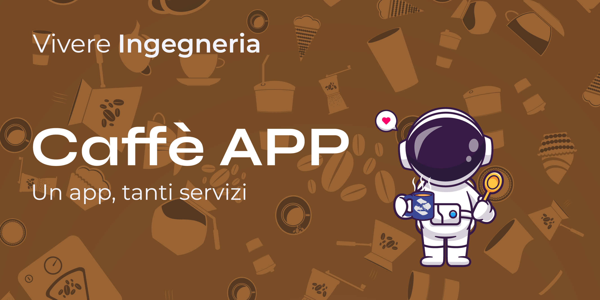

# Vivere Kaffettino

SELEZIONA LINGUA [🇬🇧](../Resources/) [🇮🇹](./README.ita.md)

## Buongiornissimo, KAFFÈÈÈ?!

Vivere Kaffettino è un **applicativo telegram** che permette agli utenti dell'ateneo di Palermo, appartenenti all'associazione di **Vivere Ingegneria**, di **pagare il proprio caffé in modo facile, veloce ed intuitivo.**

## Come funziona?

Un esp8266 scannerizza una **carta NFC** precedentemente assegnata ad un utente.
Se il suo saldo è positivo (o di poco negativo) decurta il costo del caffé.
La card verrà poi ricaricata da un gestore.

## Gestione Magazzino

Qualora in magazzino non risultino più caffé, **manda una notifica al gestore**, non permettendo di accreditare altri caffé.

## Non solo caffé!

L'applicazione **è stata creata per i caffé**, ma **non** vuol dire che **dobbiamo limitarci solo ad essi**!
Si possono mettere in "magazzino" bottigliette d'acqua, snack e molto altro, **l'unico limite è la tua fantasia**!

## Documentazione (WIP)

Tutta la **documentazione, amministrativa ed utente** è sotto la cartella [Docs](./Docs).

## TEAM

### Relazioni esterne e documentazione

[Gabriele Fazzari](https://www.linkedin.com/in/gabriele-fazzari-0b79241bb/) - Project Supervisor, Technical Writer

### Sviluppo

[Alessandro Buffa](https://github.com/ExalFabu) - Senior Dev

[Daniele Orazio Susino](https://www.linkedin.com/in/susinodaniele/) - Lead Dev

[Salvatore Lucio Auria](https://www.linkedin.com/in/salvatore-lucio-auria-15a680210/) - System Admin

[Giovanni Castelli](https://www.linkedin.com/in/giovanni-castelli02/) - Database Consultant

### Elettronica

[Riccardo Sciacca](https://www.linkedin.com/in/riccardo-sciacca-831357218/) - Esp32 Dev

[Marco Costa](https://www.linkedin.com/in/marco-costa-599b91160/) - Electrical Engineer

### Grafica

[Giuseppe Ferro](https://www.linkedin.com/in/giuseppe-ferro2516/) - Lead Designer

[Alessandro Palumbo](https://www.linkedin.com/in/alessandro-palumbo-719577226/) - Design Illustrator

[Mariasole Di Lorenzo](https://www.linkedin.com/in/mariasoledilorenzo/) - Design Assistant
