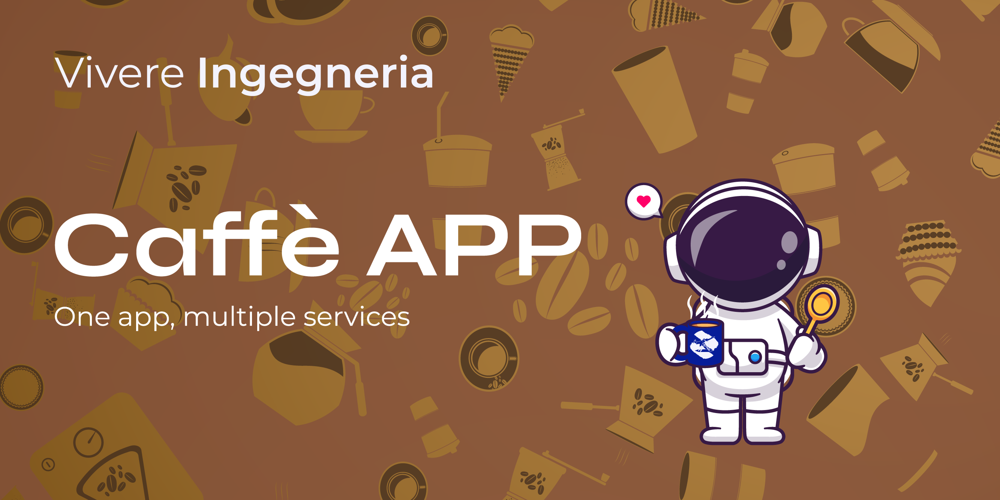

# Vivere Kaffettino

SELECT LANGUAGE [🇬🇧](./README.md) [🇮🇹](./Docs/README.ita.md)

## Good mornin', COFFEEE!??!

Vivere Kaffettino is a **Telegram application** that allows the members of the University of Palermo, belonging to the **Vivere Ingegneria** association, to **pay for their coffee in an easy, fast, and intuitive way**.

## How does it work?

An **ESP8266** scans an **NFC card** previously assigned to a user. If their balance is positive (or slightly negative), it deducts the cost of the coffee. The card is then recharged by an administrator.

## Warehouse Management

If there is no coffee left in the warehouse, **it sends a notification to the administrator**, preventing further coffee credits.

## Not just coffee!

The application was **created for coffee**, but that doesn't mean we have to **limit** ourselves to it! You can stock water bottles, snacks, and much more in the "warehouse." **The only limit is your imagination!**

## Documentation (WIP)

All the **administrative and user documentation** is located under the [Docs](./Docs) folder.

## TEAM

### Relationships and documentation

[Gabriele Fazzari](https://www.linkedin.com/in/gabriele-fazzari-0b79241bb/) - Project Supervisor, Technical Writer

### Development

[Alessandro Buffa](https://github.com/ExalFabu) - Senior Dev

[Daniele Orazio Susino](https://www.linkedin.com/in/susinodaniele/) - Lead Dev

[Salvatore Lucio Auria](https://www.linkedin.com/in/salvatore-lucio-auria-15a680210/) - System Admin

[Giovanni Castelli](https://www.linkedin.com/in/giovanni-castelli02/) - Database Consultant

[Gabriele Lo Cascio](https://www.linkedin.com/in/gabriele-locascio/) - Telegram Dev

### Electronics

[Riccardo Sciacca](https://www.linkedin.com/in/riccardo-sciacca-831357218/) - Esp32 Dev

[Marco Costa](https://www.linkedin.com/in/marco-costa-599b91160/) - Electrical Engineer

### Graphics

[Giuseppe Ferro](https://www.linkedin.com/in/giuseppe-ferro2516/) - Lead Designer

[Alessandro Palumbo](https://www.linkedin.com/in/alessandro-palumbo-719577226/) - Design Illustrator

[Mariasole Di Lorenzo](https://www.linkedin.com/in/mariasoledilorenzo/) - Design Assistant
